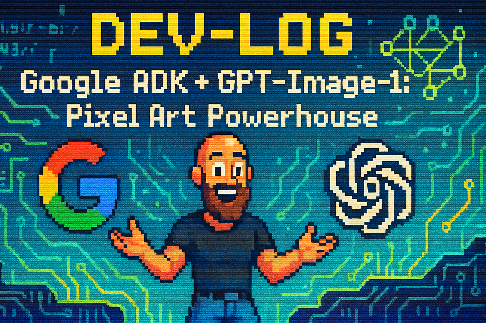

<div align="center">
  
</div>

# ADK Image Agent with GPT-Image-1

[](https://www.youtube.com/@TonyAlfredsson)

Welcome to the **ADK Image Agent with GPT-Image-1** project! This repository showcases a powerful AI agent built using Google's Agent Development Kit (ADK) that leverages the capabilities of OpenAI's cutting-edge `gpt-image-1` model for advanced image generation and manipulation tasks.

This project serves as a practical example and is featured in a Dev-Log series on the [@TonyAlfredsson YouTube channel](https://www.youtube.com/@TonyAlfredsson). Follow along to see how it was built and how it can be extended!

## ✨ Introduction

This agent demonstrates how to integrate sophisticated image understanding and generation capabilities into an ADK-based system. It provides a set of tools that allow users (or other agents) to:

*   Generate entirely new images from detailed text descriptions.
*   Edit existing images based on prompts.
*   Perform masked edits, modifying only specific parts of an image.
*   Generate segmentation masks for objects within an image.
*   Combine multiple images based on a prompt.

Built entirely with the Google ADK framework, it uses Gemini Flash for prompt enhancement and the OpenAI API (`gpt-image-1` model) for the core image processing tasks.

## 🚀 Features

*   **Image Generation:** Create novel images using text prompts enhanced by Gemini Flash.
*   **Image Editing:** Modify existing images using natural language instructions.
*   **Masked Image Editing:** Apply edits precisely using image masks.
*   **Mask Generation:** Automatically generate masks for specified objects in an image.
*   **Image Combination:** Blend multiple input images together based on a descriptive prompt.
*   **ADK Integration:** Built entirely within the Google Agent Development Kit framework.
*   **Configurable:** Easily configure API keys and settings via environment variables.
*   **Local Saving:** Option to save generated/edited images locally.
*   **State Management:** Includes logic to manage image state between tool calls for multi-step editing workflows.

## 🛠️ How It Works

The `main_agent` acts as a router, directing requests to a specialized `image_agent`. The `image_agent` uses an LLM (Gemini Flash) to interpret user requests and select the appropriate tool:

1.  **Generation/Editing:** Calls image tools (`_generate_image_with_openai`, `_edit_image`, etc.). These tools interact with the OpenAI API and save the resulting image as an ADK **Artifact**. They return artifact details (`filename`, `version`).
2.  **State Update (Workaround):** Because modifying session state within the same tool function currently prevents the ADK Web UI from displaying the artifact, a two-step process is used for subsequent edits:
    *   The LLM is instructed to call a dedicated tool (`_save_image_artifact_to_state`) *after* a successful image generation/edit if further modifications are anticipated.
    *   This second tool loads the artifact data using the filename/version and saves the necessary image data (base64 string) to the session state (`uploaded_image_b64`, `uploaded_image_parts`).
3.  **Subsequent Edits:** Tools like `_edit_image` or `_edit_image_with_mask` can then retrieve the image data from the session state to perform further modifications.

This separation ensures both artifact display in the UI and state persistence for multi-turn editing.

## 💻 Technology Stack

*   **Framework:** Google Agent Development Kit (ADK)
*   **Language:** Python 3.x
*   **LLMs:**
    *   OpenAI `gpt-image-1` (via `openai` library) for image tasks.
    *   Google Gemini Flash (via `google-genai` library) for prompt enhancement and agent control.
*   **Core Libraries:** `google-adk`, `openai`, `google-genai`, `Pillow`, `python-dotenv`
*   **Package Management:** `uv` (recommended) or `pip`

## ⚠️ Known Issues

*   **ADK Web UI Artifact Display & State Modification:** There is a subtle interaction within the ADK framework or its Web UI where modifying the session state (`tool_context.state`) inside a tool function seems to prevent the UI from correctly displaying the artifact returned by that *same* function call, even if the artifact is saved successfully and the correct information is returned. 
    *   **Workaround:** This project uses a two-step approach. Image generation/editing tools save the artifact and return its details (triggering UI display) but *do not* modify state. A separate tool (`_save_image_artifact_to_state`) is then called by the LLM (based on prompt instructions) to load the artifact and update the state for subsequent edits.
    *   **Impact:** This means the LLM needs specific instructions to call the state-saving tool. While the core functionality works, this adds a step to the agent's internal workflow.
*   **Mask Artifact Display:** Due to the issue above, the generated mask artifact from `_generate_mask` might not consistently display in the ADK Web UI, even though the mask *is* correctly saved to the state (allowing subsequent masked edits to function).

## ⚙️ Setup & Installation

Follow these steps to get the agent running on your local machine.

**1. Clone the Repository**

```bash
git clone https://github.com/LiquidError/adk-image-agent-with-gpt-image-1
cd adk-image-agent-with-gpt-image-1
```

**2. Configure API Keys**

This project requires API keys for both Google (for prompt enhancement and agent control) and OpenAI (for image generation/editing).

*   Copy the example environment file:
    ```bash
    cp .env.example .env
    ```
*   Edit the `.env` file and add your actual API keys:
    ```dotenv
    GOOGLE_API_KEY="YOUR_GOOGLE_API_KEY_HERE"
    OPENAI_API_KEY="YOUR_OPENAI_API_KEY_HERE"
    ```
*   The `agents/main_agent/tools/settings.py` file uses the `python-dotenv` library to load these keys automatically. It also defines other configurable parameters like the OpenAI model, image size/quality, and local saving options.

**3. Set Up a Virtual Environment**

It's highly recommended to use a virtual environment.

*   **Using `uv` (Recommended)**
    *   Install `uv` if needed (see [official `uv` documentation](https://github.com/astral-sh/uv#installation)).
    *   Create and activate the virtual environment:
        ```bash
        uv venv
        source .venv/bin/activate # (or .venv\Scripts\activate on Windows)
        ```
*   **Using Python's built-in `venv`**
    *   Create and activate the virtual environment:
        ```bash
        # On macOS/Linux: 
        python3 -m venv .venv && source .venv/bin/activate
        # On Windows:
        python -m venv .venv && .venv\Scripts\activate 
        ```

**4. Install Dependencies**

*   **Using `uv` (Recommended):**
    ```bash
    uv sync
    ```
*   **Using `pip`:**
    ```bash
    pip install -r requirements.txt 
    ```

## ▶️ Running the Agent

You can interact with the agent using the ADK CLI:

**1. Interactive Web UI (`adk web`)**

This is the easiest way to test.

```bash
adk web --port=8080 ./agents/ 
```

Navigate to `http://localhost:8080` in your browser. Select the `main_agent`. You can then:
*   Ask it to generate images (e.g., "Create a pixel art image of a happy dog").
*   Upload an image using the UI's upload button.
*   Ask it to edit the uploaded/generated image (e.g., "make the dog wear a hat", "change the ball to green"). Remember the LLM needs to call `_save_image_artifact_to_state` after generation if you want to edit immediately.

**2. Single Run (`adk run`)**

Execute a specific agent task directly. This is more complex as you need to manage session state and potentially artifact references manually in the input.

```bash
# Example: Generating an image (input focuses on user message)
# The agent orchestrates the tool calls internally.
adk run ./agents/main_agent --input '{"role": "user", "parts": [{"text": "Generate a realistic photo of a cat wearing sunglasses"}]}}' 
```

**3. API Server (`adk api_server`)**

Deploy the agent as an API endpoint.

```bash
adk api_server --port=8080 ./agents/ 
```

Refer to the [ADK documentation on deployment](https://google.github.io/adk-docs/deploy/agent-engine/) for API interaction details.

## 📺 YouTube Dev-Log & Future Plans

This project is part of a YouTube Dev-Log series exploring AI tools.

*   **Watch:** [youtube.com/@TonyAlfredsson](https://www.youtube.com/@TonyAlfredsson)
*   **Inspiration:** Based on concepts explored in the [OpenAI Cookbook example for GPT-Image-1](https://github.com/openai/openai-cookbook/blob/main/examples/Generate_Images_With_GPT_Image.ipynb).

**Upcoming Dev-Logs:**

*   Integrating this agent into a real-world application.
*   Building a frontend interface for easier interaction.
*   Exploring more advanced agentic workflows with ADK.

Stay tuned!

## 🔗 References

*   **Google Agent Development Kit (ADK) Documentation:** [google.github.io/adk-docs](https://google.github.io/adk-docs)
*   **OpenAI Cookbook - Generate Images With GPT-Image:** [OpenAI GitHub](https://github.com/openai/openai-cookbook/blob/main/examples/Generate_Images_With_GPT_Image.ipynb)
*   **UV Documentation:** [astral.sh/uv](https://astral.sh/uv)

## 📜 License

This project is licensed under the Apache License 2.0. See the [LICENSE](LICENSE) file for details.

## 🤝 Contributing & Feedback

Contributions are welcome! Please feel free to open an issue or submit a pull request.

Feedback and suggestions are also encouraged! Please leave comments on the YouTube videos or open an issue in this repository.